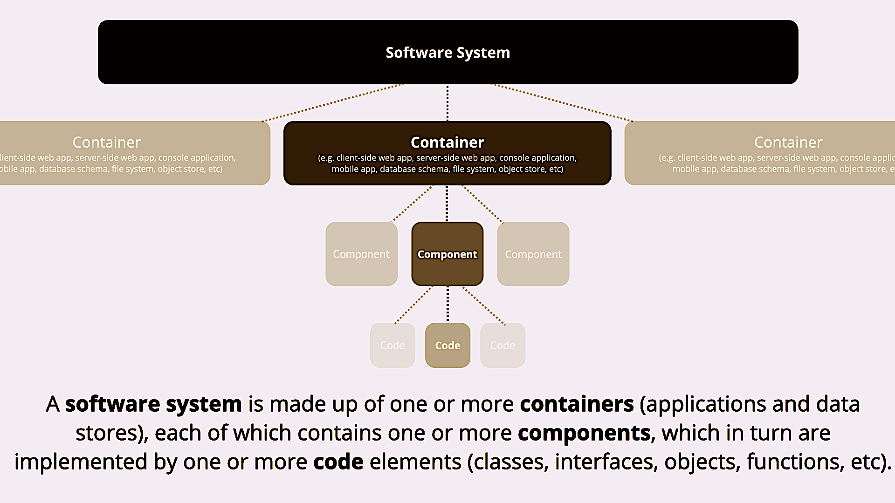
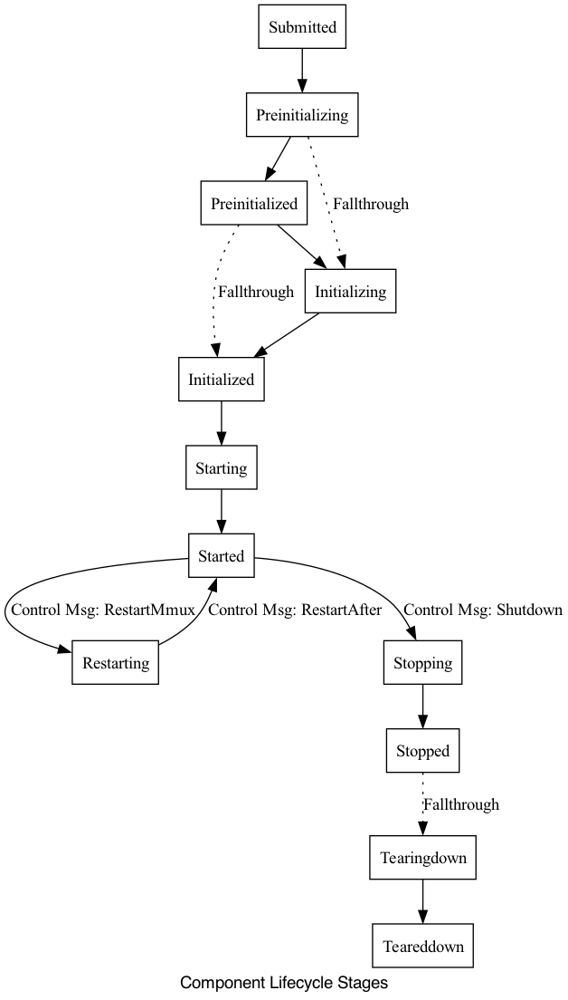

# Kinesis

Kinesis is an extensible model for developing event-driven microservices in golang. The software architecture is designed 
on the [C4](https://c4model.com) model, making it easy to separate various functionalities which serve a purpose, into 
separate <b>components</b>. A <b>container</b> comprises of those components which eventually make up a system.

<br/>



<br/>

A system could also be viewed as a collection of containers, each catering to an aspect of the overall system and therefore
a container could be considered as a component. In addition to modelling container <-> component heirachies emphasis is also provided on how components act on a stimuli (```events or messages```) and communicate with each other.

Each component gets to implement its own logic within each lifecycle stage, namely ```preinit, Init, PostInit, Start, Stop``` etc. The stage to which a component transitions next, is determined by a simple state machine (SM), generically implemented to oversee a component. Due to this generic nature, the SM is not involved with how each component would run within a stage or how it recovers from an error condition.

<br/>



<br/>

Depending on the stimuli received, a component has the flexibility to alter its own state at any lifecycle stages, but at the same time is also subject to change by the encompassing container. For e.g just when a component is processing an event stimuli which causes the state to "Restart", the root container would have received a system interrupt to shutdown all the components under it. So at any point in time, a component state is being determined by 2 or more separate goroutines which are concurrently being executed in different contexts.

Add-on components such as an 'HTTP server' or 'Persistence' can be selectively included and activated by applying the appropriate Golang build tags during the build or 'go run' execution.
<br/>

### Component design
The ```SimpleComponent``` type implements all the methods within a Component interface. Additional component types could be composed by including SimpleComponent as an embedded type thereby acquiring all the methods of the embedded type, which could be overridden by the embedding component. Container types could be composed by embedding the ```Container``` type, which in turn embeds the SimpleComponent type.

Have a look at Component lifecycle FSM defined [here](https://github.com/srcfoundry/kinesis/blob/5c87ad24312a2f5613688da46cdc21c769c73474/component/container.go#L210)

<br/>

### Dynamic HTTP URI
The framework dynamically creates HTTP URIs' for all exported methods within a component, which resemble an HTTP handler function ```func (w http.ResponseWriter, r *http.Request)```. At the time of initializing a component, HTTP URIs' are derived from the component type and added to a HTTP handler map, maintained within the root container, for purpose of forwarding HTTP requests. Corresponding HTTP handler entries are removed in the event a component is being stopped and teared down. 

To activate the HTTP server and expose components as HTTP endpoints, build or run with build tag ```-tags=http```
<br/>

### Persistence
Persisting data can be achieved by incorporating Relational or NoSQL database functionality as an add-on, facilitated through the use of appropriate build tags. Support for popular Relational (e.g. MySql, Postgres) & NoSQL (e.g. elasticsearch, MongoDB) databases could be added by implementing common Database methods defined within ```component``` package. Kinesis includes a simple file based NoSQL ```simplefileDb``` database, which can be enabled using the build tag ```-tags=simplefiledb```. 

Component fields' tagged with ```persistable:"native"``` will be automatically stored in the database whenever a component undergoes a stage change or processes a message. 

e.g. of using ```persistable:"native"``` field tag within "App" component.

```
type App struct {
	component.Container
	PreviousExecutions   int    `persistable:"native"`
	LastExecutedDateTime string `persistable:"native"`
	ApiKey               string `persistable:"encrypt"`
}
```

Sensitive component fields' tagged with ```persistable:"encrypt"``` would be stored encrypted in the DB with the help of a symmetric encryption key supplied using the ```KINESIS_DB_SYMMETRIC_ENCRYPT_KEY``` environment variable. The database connection string should be supplied through the ```KINESIS_DB_CONNECTION``` environment variable. Connection string should be prefixed by the connection type prefix, viz., file://, mongodb://, https:// etc., corresponding to the Database being used for persistence.


e.g. while using ```-tags=simplefiledb``` use environment variable ```KINESIS_DB_CONNECTION=file://[absolute path to database directory]  KINESIS_DB_SYMMETRIC_ENCRYPT_KEY=[base64 encoded string]```

<br/>

### A note on resiliency
The framework consists of a peculiar design consideration to always push a Golang defer function to be executed within a separate goroutine, in the event a state function finishes execution. In order to acheive this, a state method would always start with a defer function being included first. The defer function always includes a call to the State Machine(SM), to decide which stage it needs to transition next. This level of resilience guarantees that the call to SM would get pushed to the call stack no matter if a component panics or errors out. In addition, the defer function is executed within a separate goroutine in order to avoid cyclic call, which otherwise could lead to a stack overflow.

<br/>

### Building
Usage: ```go build [add-on options] cmd/kinesis.go```

Add-on options:
- ```http : HTTP add-on which starts an http server on port 8080 and exposes components as REST objects```
- ```simplefiledb : Persistence enabled using Simple file based NoSQL Database```

e.g.,  ```go build -tags=http,simplefiledb cmd/kinesis.go ```

<br/>

### Running
Usage: ```env [environment variables] ./kinesis```

environment variables options:
- ```KINESIS_DB_CONNECTION : Database connection string if any of the Persistence build tags are used```
- ```KINESIS_DB_SYMMETRIC_ENCRYPT_KEY : Encryption key to encrypt appropriately tagged component fields while persisting to database ```

e.g.,  ```env KINESIS_DB_CONNECTION=file:///opt/database/kinesisDB  KINESIS_DB_SYMMETRIC_ENCRYPT_KEY=68gjh658jhg8tf ./kinesis```

use ctrl-c to quit
<br/>